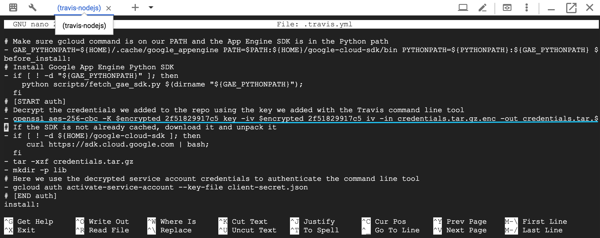

## Nodejs App Auto-deployment with Travis CI in Google Cloud

Hey Ngoc here!!!

[Continuous Integration](https://www.thoughtworks.com/continuous-integration) has been becoming an important aspect in software development. The fundamental idea came from the needs of speed and convinence in deployment. 

With the help of some automatic tools such as [Jenkin](https://jenkins.io/), [CircleCI](https://circleci.com/) or 
[Travis](https://travis-ci.org/), developers are able to save a plenty of time and more importantly reduce the incidents in deploying their applications.

Why did I choose **Travis** for this project?

In fact, I have been using **CircleCI** for 2 years and **Jenkin** for 3 years, yet the reason for choosing [Travis] because it's **CircleCI** combined with **Jenkin**. Interestingly, It inherited some cool features like pretty user-friendly dashboard, good speed :) from **CircleCI** and it's free like **Jenkin**. How awesome it is!!!!

Why did I decide to make a demonstration of **Nodejs** instead of using Python or Ruby?

The simple castalys for using Nodejs is a small number of Docs related to applying CI/CD with Nodejs in Google Cloud. Additionally, I have been a Nodejs developer for more than 3 years. :D

### Tutorial Outline
- 0. [Before you begin](#0-before-you-begin)
- 1. [Setup Nodejs App](#1-setup-nodejs-app)
- 2. [Setup App Engine](#2-setup-app-engine)
- 3. [Enable neccessary apis](#3-enable-neccessary-apis)
- 4. [Integrate Github with Cloud Shell](#4-integrate-github-with-cloud-shell)
- 5. [Integrate Travis with Github Repository](#5-integrate-travis-with-github-repository)

### 0. Before you begin

Please create two accounts [Travis](https://travis-ci.com/) and [Github](https://github.com/) if you haven't had yet.

### 1. Setup Nodejs App

#### 1.1 Initialize a Nodejs project

Type this command to initialize Nodejs Project ```npm install```


We notice that a package.json is created instantly in your project.


#### 1.2 Install dependencies

We install two things:

- [Express](https://expressjs.com/) - Web framework for Node.js
- [EJS](https://ejs.co/) - Embedded JavaScript templating.


#### 1.3 Implement app.js

Of course we need a function to start sever and serve some basic requests. 

We create an ```app.js``` file and add some simple lines of codes.

```
'use strict';

const express = require('express');
const app = express();

app.set('view engine', 'ejs');

app.get('/', (req, res) => {
  res.render('index');
});

// Start the server
const PORT = process.env.PORT || 8080;
app.listen(PORT, () => {
  console.log(`App listening on port ${PORT}`);
  console.log('Press Ctrl+C to quit.');
});

```

We will return a html page when the server receives a HTTP request from a client.

Although we set up to use port **8080** locally but when deploying these codes, App Engine is able to recognize it and change to suitable port such as **80** for http and **443** for https.

Subsequently, we add a folder called views contains a ejs file `index.ejs`.


Start app and enjoy!!!


### 2. Setup App Engine

#### 2.1 Access [Google Cloud](https://console.cloud.google.com)
#### 2.2 Create a new project


Name this project. I gave my project name as "Travis-nodejs" 


#### 2.3 Create App Engine Application

Go **Menus > App Engine > Dashboard > Create Application**


You can select your particular region. I chose **us-central**


**Create app** -> **Select Language**. I selected Nodejs.


**Finish app creation**


### 3. Enable necessary apis

Click here to [Enable essential apis](https://console.cloud.google.com/flows/enableapi?apiid=compute,books,appengine)

It consists of **Computer Engine**, **Google Books** and **App Engine APIs**.


It takes around 2-3 minutes to finish this progress.

Done!!!


### 4. Integrate Github with Cloud Shell

#### 4.1 Go to [Cloud Shell](https://console.cloud.google.com/cloudshell/)
You can imagine that Cloud Shell is simply a terminal in browser. You can use it as **PowerShell** in Windows or **Terminal** in Mac.

#### 4.2 [Generate SSH Key in Cloud Shell](https://help.github.com/en/articles/generating-a-new-ssh-key-and-adding-it-to-the-ssh-agent)


#### 4.3 [Add SSH Key to your Github Account](https://help.github.com/en/articles/adding-a-new-ssh-key-to-your-github-account#platform-linux)

#### 4.4 [Verify the link between Github and Cloud Shell works well](https://help.github.com/en/articles/adding-a-new-ssh-key-to-your-github-account#platform-linux)

#### 4.5 Clone your app from Github to Cloud Shell


### 5. Integrate Travis with Github Repository

On **[Travis](https://travis-ci.com/)**, log in by your Github account.

Travis will list all your repositories. 

Note that: Two things required to integrate your repo to Travis

- You **own** this repository, meaning that if you are only the collaborator, you can not link the travis to your project. In this case, you need to ask the owner to help you enable it.
- An .travis.yml file **has been added already** to your repo in **root folder**. :). Copy all content of .travis.yml [here](https://github.com/bangoc123/google-cloud-for-fun/blob/master/.travis.yml).


You can see the screen like this on Travis Dashboard:


Travis only is triggered when a commit is pushed to Github. At the first time, you may not see any log/build yet.

You can check whether the Travis is triggered or not at tab **Pull History**


In case you don't see anything updated, please try to create a **test commit** and push it to Github. :)


### 6. Integrate Cloud Shell with Travis

#### 6.1 Install Travis client

```
  sudo gem install travis
```

#### 6.2 Create Google Cloud credentials

These credentials give **Travis** permissions to run some scripts automatically in Cloud Shell.  

These scripts are defined in **.travis.yml** 

- Create Service Account
  - Go to [Service Account Page](https://console.cloud.google.com/projectselector2/iam-admin/serviceaccounts?supportedpurview=project&project&folder&organizationId)
  - Select your project
  - Create service account
  - **Step 1**: Name your service account 
    
  - Step 2: Create roles for your account
    - Find and Select **App Engine Admin**. This role enables Travis to have full access to our App Engine.
    - Find and Select **Storage Admin**. This gives Travis full control of GCS resources.
    - Find and Select **Cloud Build Editor**. This allows Travis to run some scripts like **gcloud scripts** or libraries installations.
    

  - **Step 3**: Create Key > Json > Create. A Jason file will be downloaded automatically into your computer.

#### 6.3 Upload file to the project in Cloud Shell

Upload to Cloud Shell by using **Upload File** features.

  

  

  Note that the file you upload will be placed in **/home/your-account-name**. Therefore, you need to move it to the cloned project.

  ```
  mv ~/<your_credentials_filename>.json ~/google-cloud-for-fun/infrastructures/travis-ci-nodejs/client-secret.json
  ```

  Make sure everything will look like this:

  

#### 6.4 Create the Books API Key

  - Go to [APIs Credentials](https://console.cloud.google.com/apis/credentials)

  - Create API Key

  
  
  - Create  **api_key** file in Cloud Shell

  ```
  export API_KEY=[YOUR_API_KEY]
  cd ~/google-cloud-for-fun/infrastructures/travis-ci-nodejs
  echo "key = '${API_KEY}'" > api_key.py
  ```
  

#### 6.5 Encrypt credentials for Travis

- We will combine **client-secret.json** and **api_key** into a single file **credentials.tar.gz** by using the script:

  ```
  tar -czf credentials.tar.gz client-secret.json api_key.py
  ```
- Login to Travis CI

  ```
  travis login --pro
  ```
  You will use the Github Account to login into **Travis**

  
  
- We need to encrypt this file for public usage

  Use this command:
  ```
  travis encrypt-file credentials.tar.gz --pro
  ```
  
  

#### 6.5 Update Travis file

- Replace text **DECRYPT_COMMAND** in .travis.yml by the text begining with **openssl aes...** in Cloud Shell.
  ```
  sed -i 's/DECRYPT_COMMAND/[YOUR_COMMAND_OUTPUT]/g' .travis.yml
  ```

  
  
- Replace text **travis-nodejs** in .travis.yml by your project ID in Cloud Shell.

  ```
  sed -i "s/travis-nodejs/${DEVSHELL_PROJECT_ID}/g" .travis.yml
  ```

  

- Push changes to Github

  ```
  git add credentials.tar.gz.enc .travis.yml
  git commit -m "Adds encrypted credentials for Travis and updates project name"
  ```


